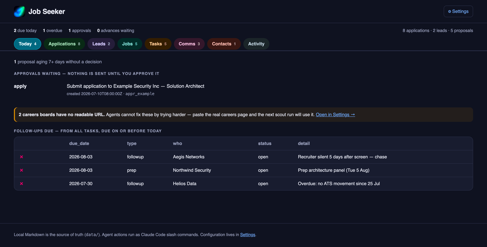
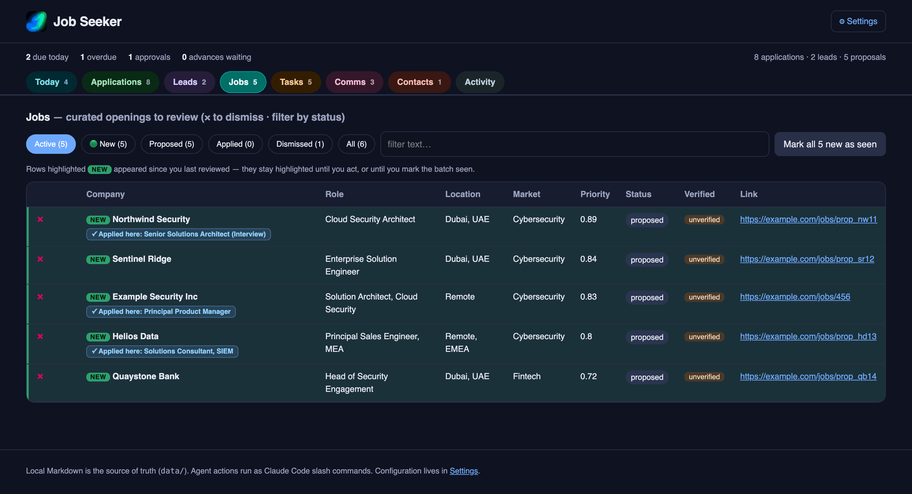
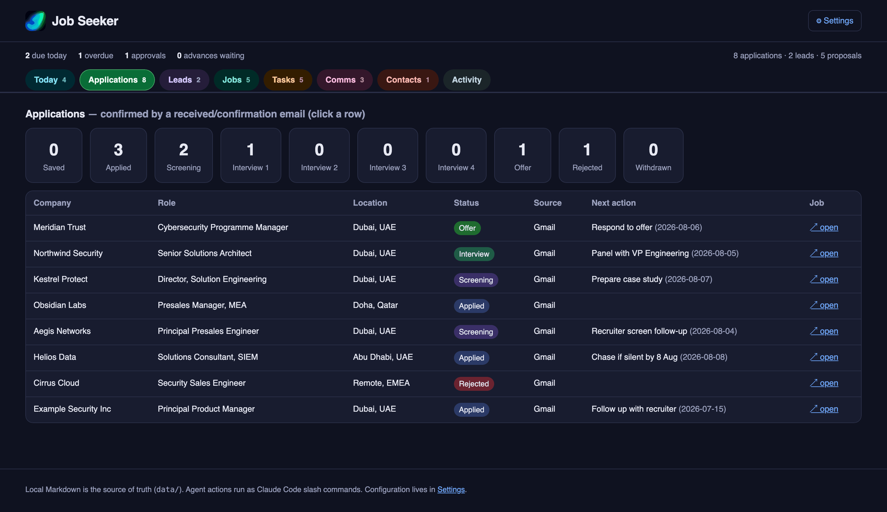
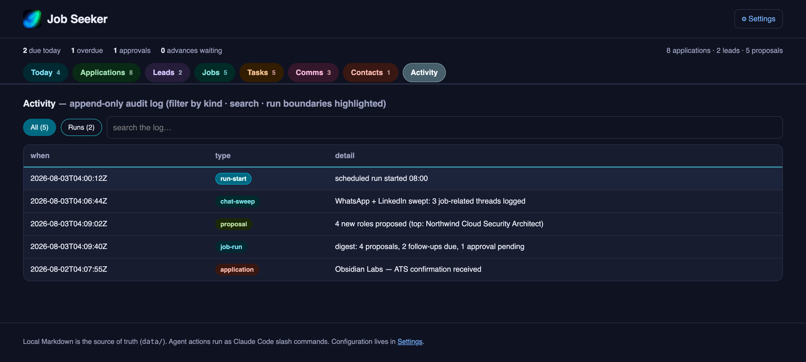

<p align="center">
  
</p>

<h1 align="center">JobSeeker</h1>

<p align="center">
  <strong>Your job search, remembered.</strong><br>
  A local-first assistant that watches your email, chats and calendar, finds roles worth your time,<br>
  and every morning tells you the few things that actually need you today.
</p>

<p align="center">
  <em>It never applies to anything, and never sends a message, without your explicit approval.</em>
</p>

<p align="center">
  <a href="LICENSE"></a>
  
  
  <a href="https://myjobseeker.ai"></a>
</p>

---

## The problem

A job search falls apart in the gaps between apps. Applications live in ATS portals, recruiters
reply by email, referrals arrive over WhatsApp, conversations continue on LinkedIn, and interviews
land in a calendar. Nothing joins them up — so the things that go wrong are failures of *memory*,
not effort:

- An application goes quiet and you notice three weeks later.
- Someone offers a referral in a chat. The CV never gets sent.
- You apply to the same job twice, because it was reposted with a new reference number.
- You find a great role, then lose it in a list of forty.
- You agree a follow-up in one app and complete it in another, so it stays open forever.

**JobSeeker is the thing that remembers.** It reads the channels you already use, keeps one honest
picture of where everything stands, and surfaces the short list that needs you — while leaving every
decision, application and message to you.

---

## What it looks like

**Today** — the only screen most mornings need: what is due, what is waiting on a click, what is
overdue.



**Jobs** — roles found and scored against your CV, best match first. Reposts of jobs you have already
applied to are flagged rather than silently re-offered.



**Applications** — every application and lead, with its stage, its next action, and when it last
moved.



**Activity** — an append-only log of everything the system did, with run boundaries marked, so you
can always reconstruct what happened and when.



**Settings** — scoring weights, and one **Companies** page listing every company you are targeting:
why it is on the list, and where its jobs are read from. Grouped by market, collapsible, sortable,
and searchable across names, markets and notes.


> Every screenshot above uses a fictional sample dataset, not real data.
> See it yourself: `JOBSEEKER_DATA_DIR=data/.example npm run dashboard`

---

## How it works, in plain terms

Once a day (or whenever you ask), JobSeeker:

1. **Reads your email and calendar** for anything job-related — recruiter mail, "we received your
   application", interview invitations — and files it.
2. **Reads your WhatsApp and LinkedIn message lists** for job-related conversations, including ones
   you have already read but never acted on. That is usually where referrals hide.
3. **Looks for new roles** at companies matching what you are targeting, and scores each against
   your CV.
4. **Checks what has gone quiet** — applications with no movement, follow-ups you promised, offers
   with a deadline.
5. **Sends you a short summary** on WhatsApp with the handful of things that need you.

Then it stops. It does not apply. It does not reply. Anything that would act on your behalf is
queued for you to approve.

## What it will never do

- **Never applies to a job** without you approving that exact application.
- **Never sends a message** — email, LinkedIn or WhatsApp — without you approving that exact message.
- **Never opens an unread chat.** Opening a conversation marks it read, which would destroy your own
  sense of what still needs attention — so unread threads are left strictly alone and only their
  list preview is kept. Threads you have already read cost nothing to open, so those it does open and
  read properly, because "Sure, I will text you next week" is not a record of what was agreed.
- **Never logs your private conversations.** Most of a personal WhatsApp is family and friends. Only
  threads with a job-search signal are recorded; the rest are counted and left alone.
- **Never sends your data anywhere.** Everything stays in files on your own machine.

## Where your data lives

In a folder of plain text files you can open, read, edit and delete. No database, no cloud account,
no export needed. If you stop using JobSeeker tomorrow, you keep everything in a format any text
editor can read.

That folder is excluded from version control, so it cannot be published by accident.

> **Technical reader?** How it works, why local Markdown is the source of truth, how it drives Chrome
> without a debugging port, and the safety properties that hold: **[docs/ARCHITECTURE.md](docs/ARCHITECTURE.md)**

---

## Getting started

**You need:** a Mac, [Google Chrome](https://google.com/chrome),
[Node 20+](https://nodejs.org), and [Claude Code](https://claude.com/claude-code). Gmail and Google
Calendar work through Claude Code's own connectors — nothing to install for those.

**Optional — WhatsApp delivery.** By default the digest and approval prompts sit in the dashboard.
To have them reach your phone instead, install
[whatsapp-claude-channel](https://github.com/Rich627/whatsapp-claude-plugin), a third-party Claude
Code plugin (not maintained by this project — a linked-device messaging bridge with its own access
control):

```bash
claude plugin marketplace add Rich627/whatsapp-claude-plugin
claude plugin install whatsapp-claude-channel@whatsapp-claude-plugin
```

Then, inside Claude Code, pair it to your own WhatsApp:

```text
/whatsapp-claude-channel:setup
```

`/onboard` (below) then asks for your number and saves it as `whatsapp_owner_jid` in
`config/job-seeker.config.md`. Skip all of this and JobSeeker still works exactly the same — the
digest is written to `data/.last-digest.md` and shown in the dashboard either way.

**The short way.** Download the latest release, unzip it, and double-click
**`JobSeeker Setup.command`**.

> The first time, macOS will refuse to open it — it was downloaded from the internet and is not
> signed by a registered developer. **Right-click the file and choose Open**, then Open again in the
> dialog. That is macOS asking you to confirm you meant it, and it only happens once.

It checks this Mac, installs what it legitimately can, starts JobSeeker, and opens it in its own
window — no address bar, no tabs. From there the setup wizard takes over. If Node or Chrome is
missing it says so and points you at the download, rather than installing a runtime or a browser
behind your back.

Closing that Terminal window stops JobSeeker. That is the whole quit story.

**The developer way**, which does the same thing with more output:

```bash
git clone <this repo> && cd JobSeeker
npm run setup
```

`npm run setup` does the whole machine side for you. It checks what you have, installs what it can,
walks you through the one or two things macOS insists you click yourself, and then **verifies that
each one actually worked** rather than assuming. There is nothing to `npm install` — JobSeeker itself
has zero package dependencies; everything above is Claude Code or the OS, not an npm package.

It asks one question that decides how much setup you actually need:

- **Run it manually** (the default) — you run `/job-run` when you want it, nothing runs on its own.
  No background job, no System Settings changes. This is the short path, and the one to start on.
- **Run it on a schedule** — it goes off at 08:00 and sends you a summary. Because that has to work
  while you are away, it needs a few one-time macOS permissions: an Automation grant for the
  scheduler specifically, and a Chrome setting or two.

Start manual. Add the schedule later, in one command, once it has earned some trust:

```bash
npm run schedule -- 08:00
```

Then open the dashboard and introduce yourself:

```bash
npm run dashboard
```

A machine with nothing set up opens straight into a short wizard: what you are looking for, your CV,
the markets to hunt in, the answers every application form asks, which channels it may read, and
when it should run. Three of those steps can be skipped — Settings offers each one again on its own,
and says what skipping costs. Nothing runs and nothing is spent while you set up; when you finish,
Today asks whether to research your first market.

Prefer to type? Everything the wizard writes, `/onboard` writes too:

```bash
claude
```
```text
/onboard
```

The two are interchangeable — same questions, same files — so you can start in one and finish in the
other. Once a day after that:

```text
/job-run
```

That is the whole routine. It reads your channels, finds roles, and sends you a summary.

---

## Talking to it

You do not need to memorise commands. Address **`jobseeker`** in plain English and it works out what
to run:

```text
jobseeker, check my email and WhatsApp for anything new
jobseeker, find me Solution Architect roles in Dubai
jobseeker, what's my pipeline? what's due today?
jobseeker, add: call Dana on Friday about the referral
jobseeker, close anything I've already done
jobseeker, research the cybersecurity vendors worth targeting
```

There are also direct commands when you know exactly what you want:

| Command | What it does |
|---|---|
| `/job-run` | The full daily routine — the one the scheduler runs |
| `/curate` | Find and score new roles |
| `/track` | Update the tracker from Gmail, Calendar, WhatsApp and LinkedIn |
| `/apply <id>` | Prepare an application — **pauses for your approval before submitting** |
| `/followup` | Draft a follow-up — **pauses for your approval before sending** |
| `/markets` | Build or refresh the ranked company list for a market |
| `/onboard` · `/parse-cv` | First-run setup and CV parsing — the terminal version of the dashboard wizard |

And two things you run in the terminal:

```bash
npm run dashboard    # the web view, at http://localhost:4319
                     #   Settings > Setup configures everything: targeting, spend caps,
                     #   the daily run time, and a live check of what is working
npm run audit        # a plain-text health check of your whole pipeline
npm run schedule -- 09:00   # move the daily run (--show / --remove)
```

## Documentation

- [`docs/ARCHITECTURE.md`](docs/ARCHITECTURE.md) — **how it works, and why** (start here if you are technical)
- [`docs/REQUIREMENTS.md`](docs/REQUIREMENTS.md) — what the system must do, and the constraints behind it
- [`.claude/AGENT-RULES.md`](.claude/AGENT-RULES.md) — normative rules every agent follows
- [`SECURITY.md`](SECURITY.md) — the trust model, what is protected, and what is knowingly exposed
- [`CONTRIBUTING.md`](CONTRIBUTING.md) — the rules that are not negotiable, and why
- [`docs/PERMISSIONS.md`](docs/PERMISSIONS.md) — macOS permissions, what is *not* needed, and troubleshooting
- [`docs/SCHEDULER.md`](docs/SCHEDULER.md) — the unattended run
- [`docs/boards.md`](docs/boards.md) — careers-board quirks
- [`docs/PLAN.md`](docs/PLAN.md) — the original design (**superseded**, kept for history)

## Status and scope

Single-user, local, macOS. Built for one person's job search and shaped by its real failures — the
memory crash, the lost writes, the digest that contradicted itself, the nine runs in a row that
quietly read nothing. Most of the defensive design here exists because something went wrong first.

Not intended for multi-user or hosted operation, and deliberately incapable of bulk scraping or
unattended outbound messaging.

**Respecting the services it reads.** Channel access is read-only, low-volume, human-paced, and runs
from your own machine and connection. If a service challenges the session, JobSeeker stops and tells
you rather than working around it.

**Support.** This is a personal project, maintained as time allows. Bug reports with a reproduction
are welcome; a slow reply is bandwidth, not indifference. Security issues should go through
[private reporting](https://github.com/cventour/jobseeker/security/advisories/new) rather than a
public issue — see [`SECURITY.md`](SECURITY.md).

## Licence

[PolyForm Noncommercial 1.0.0](LICENSE). You may use, modify and share it for noncommercial
purposes — personal use, research, and use by nonprofits, schools and government bodies are all
fine. Commercial use requires a separate licence from the author. It comes with no warranty. This is
source-available, not open source: PolyForm licences are not OSI-approved, deliberately.
