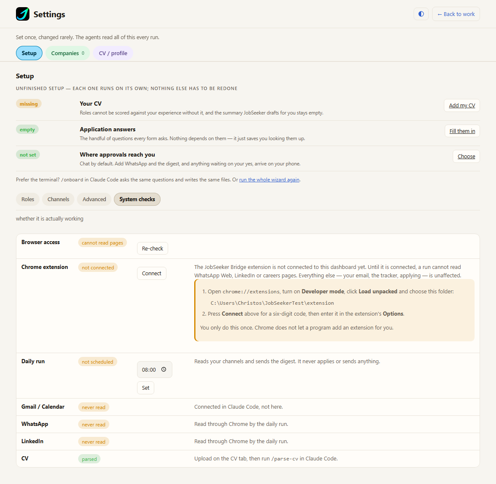
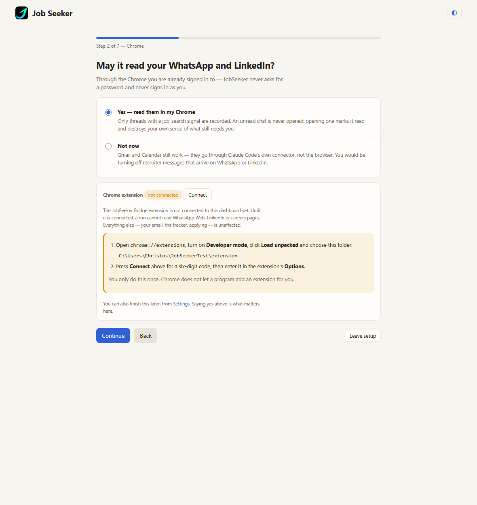
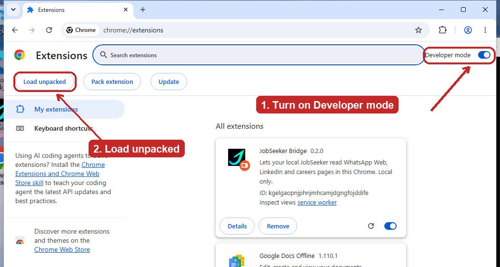
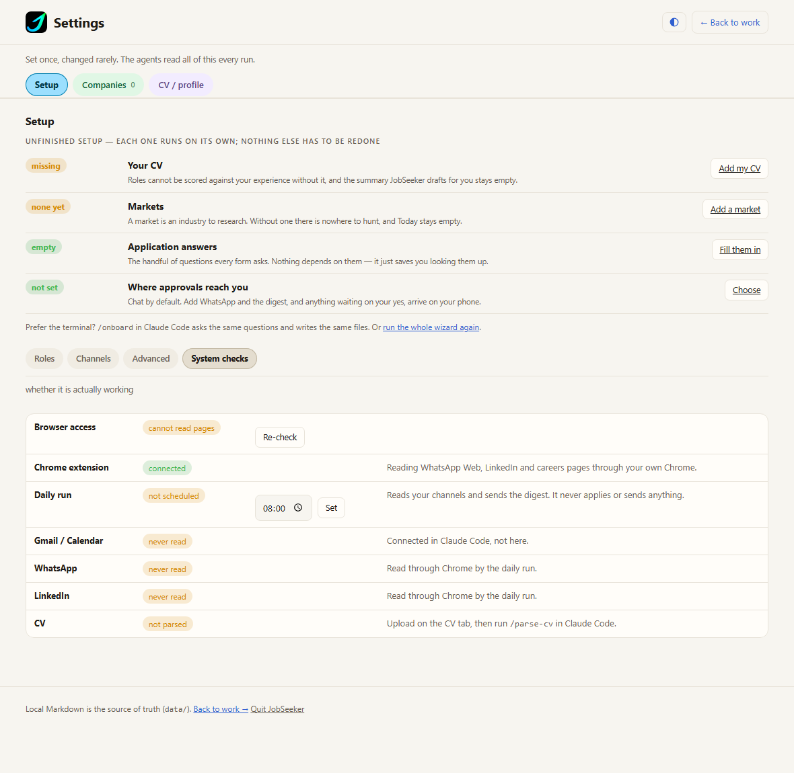

# Permissions

**Short version: run `npm run setup` once.** It checks prerequisites, installs the browser agent,
triggers each permission prompt at the right moment, and — importantly — **verifies the result rather
than trusting it**. Everything below is the reference for when something needs fixing by hand.

```bash
npm run setup
```

The two operating systems need different things, and this page covers both:

- **[Windows](#windows--no-permissions-to-grant)** — nothing to grant in System Settings. Chrome is
  read through the JobSeeker Bridge extension, which you load once and pair with a code.
- **macOS** — sections 1 to 4 below, plus "Why 'forever' needs an agent" and "The permissions are
  not granted to Node". **All of that is macOS-only** and does not apply on Windows.

The troubleshooting table at the end covers both.

---

## Windows — no permissions to grant

Windows has no TCC and no Apple Events, so there is **nothing to approve in System Settings**. There
is no Automation grant, no consent dialog, and no per-binary permission to re-approve after a Claude
Code update.

What stands in for it is the **JobSeeker Bridge** Chrome extension. It runs in your own Chrome, in
your own profile, and talks to the dashboard on `127.0.0.1` only. Full detail — the protocol, the
method allowlist, and what the extension cannot do — is in
[`extension/README.md`](../extension/README.md).

**Load it, once:**

1. Open `chrome://extensions`.
2. Turn on **Developer mode** (top right).
3. Click **Load unpacked** and choose this repository's `extension/` folder.

Chrome shows a "Disable developer mode extensions" bar on every start while an unpacked extension is
loaded. Dismiss it; it comes back next start.

**Pair it, once:**

1. Start the dashboard (`npm run dashboard`).
2. Open **Settings ▸ Browser ▸ Connect**. It shows a six-digit code, good for five minutes.
3. Open the extension's options (`chrome://extensions` ▸ JobSeeker Bridge ▸ Details ▸ Extension
   options), type the code and click **Connect**.

The setup wizard's Chrome step offers the same code. Pairing writes a token to `data/.bridge.token`
and pins the extension's `chrome-extension://` origin, so a stray web page cannot pair in its place.

**Careers pages need one more click.** By default the extension may read `web.whatsapp.com` and
`www.linkedin.com` (plus `127.0.0.1` and `localhost`) — enough for WhatsApp and LinkedIn. Reading job
postings on company careers sites needs the optional **"Also let it read careers pages"** grant
(`<all_urls>`) from the extension's options page; Chrome asks you to confirm. It is still read-only,
and the same button takes it back. Without it, a careers-page read fails with a message telling you
to grant it there.

**Chrome Memory Saver still matters on Windows** — see section 3. Discarded background tabs have no
renderer, so an extension read of one fails exactly as an Apple Event read does.

Check the current state at any time with `npm run browser:probe`. It writes
`data/.browser-status.json` with `driver: "extension"` and a `bridge` block
(`reachable`, `paired`, `connected`). The Apple Events fields read `not-applicable`.

### Connecting it, step by step

Setup offers this, and Settings shows it whenever it is not connected. Both carry the same two
steps and the same six-digit code, so it does not matter which one you start from.

**Settings, System checks.** The row says what is wrong, what it costs, and what to do. The folder
path is the one to hand to Chrome.



**Or the setup wizard, at the Chrome step.**



Then, in Chrome. **Load unpacked only appears once Developer mode is on**, which is the step people
miss:



1. Open `chrome://extensions` and turn on **Developer mode** (top right).
2. Click **Load unpacked** and choose the folder the dashboard named.
3. Press **Connect** in JobSeeker for a six-digit code.
4. On the extension's card click **Details**, then **Extension options**, and type the code.

The code lasts five minutes and is used once. The pairing it creates does not expire: it survives
restarting Chrome, restarting the dashboard, and rebooting. You only do this again if you press
**Forget pairing**, remove the extension, or delete `data/`.

When it has worked, the row turns green and the steps disappear.



---

## macOS

Everything from here to the troubleshooting table is macOS-only.

The steps `npm run setup` cannot do for you are two Chrome settings. Both are one-time.

**Let JobSeeker read page content:**

1. Open Chrome
2. Menu bar ▸ View ▸ Developer
3. Click "Allow JavaScript from Apple Events"

**Stop Chrome putting your WhatsApp and LinkedIn tabs to sleep** (section 3 — without this, reading
works when you are at the machine and fails overnight):

1. Open Chrome ▸ Settings ▸ **Performance**
2. Under **Memory Saver**, click **Add** next to "Always keep these sites active"
3. Enter `web.whatsapp.com`, click **Add**
4. Repeat for `linkedin.com`

Check the current state at any time:

```bash
npm run browser:probe
```

---

## Why "forever" needs an agent (macOS)

macOS keys Automation permission to the **responsible process**, and for an interactive Claude Code
session that is `~/.local/share/claude/versions/<version>/claude` — a version-pinned binary with no
stable identity. The consent dialog literally names the version:

> **"2.1.221" wants access to control "Google Chrome"**

Every Claude Code update is therefore a brand-new requester, and macOS asks again. Clicking Allow
*is* permanent — but only for that version, and you cannot pre-approve a version that does not exist
yet. Left alone, this repeats forever, and an unattended 08:00 run would eventually hang on a dialog
with nobody to click it.

A **LaunchAgent** does not have this problem: its responsible process is its `Program` — `/bin/bash`,
Apple-signed, at a path that never changes. Granted once, it stays granted across Claude Code
updates, macOS updates and reboots. This is why the scheduled run has always worked.

So all browser work is funnelled through `com.jobseeker.browser`:

```
caller ──► scripts/browser-do.mjs ──► launchctl kickstart ──► com.jobseeker.browser
                                                              (/bin/bash — stable identity)
                                                                     │
                                                                     ▼
                                                              Chrome, via Apple Events
```

`browser-do.mjs` falls back to running in-process if the agent is not installed, so nothing breaks
on a fresh clone — you just get prompted more often.

## The permissions are not granted to Node (macOS)

This surprises people, and it is the thing to understand before the rest makes sense.

`scripts/browser.mjs` runs under `node`, but macOS does **not** attach the permission to `node`. TCC
(the privacy system) records the grant against the **responsible process** — roughly, the app that
started the chain. So:

| How JobSeeker runs | Responsible process | Where it appears in System Settings |
|---|---|---|
| Interactively, in Claude Code | **Claude** | Automation ▸ Claude |
| Scheduled, from the LaunchAgent | **`/bin/bash`** | Automation ▸ bash |

These are two independent grants. **Approving one does not approve the other** — which is exactly how
a setup that works perfectly while you watch it fails silently at 08:00.

---

## 1. Automation — macOS

**System Settings ▸ Privacy & Security ▸ Automation**

Under each requesting app, one target must be ticked:

- **Google Chrome** — read tabs, and read page content

**System Events is no longer required.** It used to be, for checking whether Chrome was running
without launching it. That check now uses `pgrep`, which needs no permission and cannot fail for
permission reasons — so there is one fewer grant to approve, and one fewer thing to re-approve after
a Claude Code update. If you already granted it, you can safely untick it.

macOS asks for this the first time it is needed, and remembers the answer. It survives reboots,
logouts and app restarts; there is nothing extra to make it permanent.

### Granting it for the scheduled run

You cannot click a consent dialog that appears at 08:00 while you are asleep — the Apple Event times
out and the sweep silently does nothing. So trigger the prompt yourself, once, while you are at the
keyboard:

```bash
launchctl start com.jobseeker.jobrun
```

Click **Allow**. From then on the scheduled run is covered permanently. (This runs the full daily
pipeline, not just a permission check.)

### What invalidates a grant

1. Revoking it in System Settings.
2. `tccutil reset AppleEvents`.
3. **The requesting app's code signature or path changing.** macOS then treats it as a different app
   and asks again.
4. macOS reinstall, a new user account, or Migration Assistant.

Point 3 is worth knowing, and it WILL happen: `/bin/bash` is an Apple-signed OS binary at a fixed
path, so the **scheduled** grant is stable and survives everything. The **interactive** grant is
keyed to a version-pinned Claude Code binary (`~/.local/share/claude/versions/<version>`), so
**every Claude Code update re-prompts** — observed going from 2.1.220 to 2.1.221.

There is no way to pre-approve a version that does not exist yet. Clicking Allow *is* permanent, for
that version. Treat the occasional prompt as normal: you are at the keyboard when it appears, and
the 08:00 scheduled run never depends on it.

---

## 2. Allow JavaScript from Apple Events — Chrome (macOS)

**Chrome menu bar ▸ View ▸ Developer ▸ Allow JavaScript from Apple Events**

Without it, JobSeeker can still list tabs, titles and unread badges — so it can tell you *"11 unread
on WhatsApp Web"* — but it cannot read the messages themselves.

This is a Chrome profile preference (`browser.allow_javascript_apple_events`), written to disk and
synced with your Google account, so it survives restarts and follows the profile to other machines.
It is **not** a macOS setting and does not appear in System Settings.

There is no supported way to enable it from a script: doing so would need blanket **Accessibility**
access to drive Chrome's menus, which is a far broader permission than the checkbox is worth. Tick it
by hand.

---

## 3. Chrome Memory Saver (both platforms)

**Keep the WhatsApp and LinkedIn tabs active.**

Not a permission, but it belongs here: without it the permissions above are granted and reading
still fails.

Chrome discards long-idle **background** tabs to reclaim memory. A discarded tab has no renderer, so
injected JavaScript never returns — the Apple Event just hangs until it times out, which looks
identical to a broken permission. Measured on a real 36-tab browser: **1 tab in 12 answered**, and it
was the foreground one.

Add the two sites JobSeeker has to read:

1. Open **Chrome ▸ Settings** (or paste `chrome://settings/performance`).
2. Click **Performance**.
3. Under **Memory Saver**, click **Add** next to *Always keep these sites active*.
4. Enter `web.whatsapp.com` and click **Add**.
5. Click **Add** again, enter `linkedin.com`, and click **Add**.

Then confirm it took effect. Chrome records the allowlist in its own preferences, so this is
checkable rather than a matter of trusting that the clicks landed:

```bash
node -e 'const fs=require("fs"),os=require("os");
const dir=os.homedir()+"/Library/Application Support/Google/Chrome";
for (const p of fs.readdirSync(dir)) {
  const f=dir+"/"+p+"/Preferences"; if (!fs.existsSync(f)) continue;
  const ex=(JSON.parse(fs.readFileSync(f,"utf8")).performance_tuning||{}).tab_discarding||{};
  const sites=Object.keys(ex.exceptions_with_time||ex.exceptions||{});
  if (sites.length) console.log(p+":", sites.join(", "));
}'
```

(That check reads Chrome's macOS preferences path. On Windows, set the exemptions the same way in
`chrome://settings/performance` and confirm with `npm run browser:probe`.)

Both `web.whatsapp.com` and `linkedin.com` should be listed. **Check every profile it prints** — the
active profile is often not `Default` (it may be `Profile 3` or similar), and the setting only
applies to the profile it was made in.

`npm run browser:probe` is the functional check: `js_from_apple_events` should be `on`, and
`js_probe_detail` names the tab that answered.

**What this does and does not cover.** It protects tabs that are already open — in particular *your*
WhatsApp Web tab, which the sweep must reuse rather than replace, because WhatsApp Web is
single-session and a second tab steals it. Tabs the sweep opens for itself arrive awake anyway, so
they were never the problem.

**Why this is not solved in code.** Waking a discarded tab means activating it, and activation
reloads it. A LinkedIn messaging reload auto-selects the first conversation and **marks it read** —
silently clearing one of your unread badges, which is exactly the harm the list-only sweep is built
to avoid. A browser setting costs nothing and carries no such risk.

**Do not "fix" this by quitting Chrome before each run.** Restored tabs load lazily, so a fresh
browser has *fewer* live tabs, not more — and killing Chrome risks corrupting the profile store that
holds your WhatsApp Web linked-device session, which would put you back at a QR code.

---

## 4. DarkWake — why Chrome sometimes never opens at all (macOS)

Not a permission either, and not something `npm run setup` can fix, but it produces the single most
confusing failure this project has: **the digest reports "no Chrome this run", `chrome_launched_by_us`
is `true`, and yet no browser window ever appeared.**

Diagnosed by reading `pmset -g log` against four consecutive mornings: at every 08:00 firing, the Mac
was in **DarkWake** — a low-power background state macOS uses for maintenance (Time Machine,
Spotlight, mail fetch) that deliberately stays invisible: no display, no new GUI windows. `open -g -a
"Google Chrome"` reports success in DarkWake — LaunchServices accepts the request — but the actual
process never appears, because spawning a new visible application is exactly what DarkWake exists to
prevent. `ensureChrome()` in `scripts/browser.mjs` then polls for up to 180s and times out with
`Chrome process not visible yet`, which looks identical to a slow machine or a broken permission and
is neither.

**The fix ships in `scripts/job-run.sh`**, not something you need to configure: it calls
`caffeinate -u` at the very start of every run, which forces a real wake (turns the display on, exits
DarkWake) and needs no `sudo` — unlike `pmset schedule`, which does and was rejected for that reason.

**If Chrome still never opens after this**, the browser status file tells you which case you are in:

```bash
node -e 'console.log(require("./data/.browser-status.json"))'
```

- `chrome_launched_by_us: false` and no window — Chrome was not running and the launch itself
  failed; check `chrome_launch_reason`.
- `chrome_launched_by_us: true` with a `never became scriptable` blocker — this is the DarkWake
  failure mode. Confirm with `pmset -g log | grep -E "DarkWake|Sleep " ` around the run's start time.

---

## What JobSeeker does NOT need

Worth stating, because these are the permissions people assume an automation like this wants. The
first three are macOS names; on Windows there is no equivalent to grant at all, and the last two rows
apply on both platforms:

| Not required | Why |
|---|---|
| **Screen Recording** | Nothing is ever screenshotted or captured. Page content is read from the DOM. |
| **Accessibility** | No synthetic clicks or keystrokes. The browser API here exposes navigation and extraction only — no click, type or submit. |
| **Full Disk Access** | Only this repository's `data/` directory is read and written. |
| **A Chrome debugging port** | Deliberately avoided — an open CDP port lets any local process drive your browser with your full logged-in identity. See the README. |
| **Google OAuth / `credentials.json`** | Gmail and Calendar run over MCP. The OAuth flow was part of the retired TypeScript layer and has been removed. |

---

## Troubleshooting

Run `npm run browser:probe` first — it distinguishes these cases rather than reporting one vague
failure.

| Probe says | Meaning | Fix |
|---|---|---|
| `apple_events: "denied"` | Automation was refused or revoked | System Settings ▸ Privacy & Security ▸ Automation — tick Google Chrome and System Events |
| `apple_events: "prompt-pending"` | An Apple Event timed out, almost always an unanswered consent dialog | Run `launchctl start com.jobseeker.jobrun` once while present and click Allow |
| `js_from_apple_events: "off"` | Chrome is blocking scripted reads | Chrome ▸ View ▸ Developer ▸ Allow JavaScript from Apple Events |
| `js_from_apple_events: "error"` | Chrome accepted the event but no tab ran the script. Read `js_probe_detail` — "timed out" on every tab means they were discarded, **not** that permission is missing | Exempt the sites from Memory Saver (section 3), or just click the tab to wake it |
| A channel reads fine interactively but never at 08:00 | Its tab sat idle overnight and was discarded | Section 3 |
| `chrome_running: false` with a blocker | Chrome is closed and could not be started | Check `JOBSEEKER_CHROME_AUTOLAUNCH` is not set to `0` |
| `read_page_content: true` | Everything is working | — |

The first four rows are macOS. On Windows the probe reports `apple_events: "not-applicable"` and
names the bridge state instead:

| Probe says | Meaning | Fix |
|---|---|---|
| blocker `Load the JobSeeker Bridge extension and connect it from Settings ▸ Browser`, with `bridge.paired: false` | The extension has never been paired — there is no `data/.bridge.token` | Load `extension/` unpacked, then pair from **Settings ▸ Browser ▸ Connect** (see the Windows section above) |
| the same blocker with `(the bridge is not running — start the dashboard or ``npm run bridge``)` appended | Nothing is listening on loopback for the extension to poll | Start the dashboard (`npm run dashboard`), or run `npm run bridge` |
| blocker `JobSeeker Bridge extension is not connected (is Chrome running with the extension enabled?)`, with `bridge.paired: true` | Paired, but the extension is not polling — Chrome is closed, or the extension is disabled or was removed | Open Chrome; check the extension is enabled in `chrome://extensions`. `js_probe_detail` reads `extension paired but not connected` |
| blocker `Chrome was launched but the JobSeeker Bridge extension never connected within …s` | Chrome was started for you but the extension never came up | Same fix as the row above; the blocker carries the last state it saw |
| `JobSeeker Bridge rejected the pairing token` | The token and the extension no longer agree | Re-pair from **Settings ▸ Browser ▸ Connect** |
| A careers page fails but WhatsApp and LinkedIn work | The optional all-sites grant is missing | Extension options ▸ **"Also let it read careers pages"** |
| blocker `no mechanism available to read page content (bridge=not connected, …)` | Nothing can read pages this run | Connect the extension, then use **Settings ▸ Run now** |

A run that cannot read pages is **not** a failed run. It completes, records the gap in
`coverage`, and the digest names the blocker. Unread channels then age visibly through
`browser_debt` in `npm run audit` rather than disappearing.

## Privacy note

These grants are real: Automation access to Chrome means JobSeeker can read any page you have open,
including authenticated ones. On Windows the extension is the same shape of access, bounded to the
sites it holds host permissions for — WhatsApp Web and LinkedIn by default, every site once you grant
the optional careers-pages permission. That is inherent to reading WhatsApp Web and LinkedIn at all. What
bounds it is that the browser API exposes navigation, extraction, and one narrow conversation-row
click that cannot reach a button, input or form — never general clicking, typing or
submitting — and that the sweep records message content **only** for threads carrying a job-search
signal. Everything else is counted and left alone.
